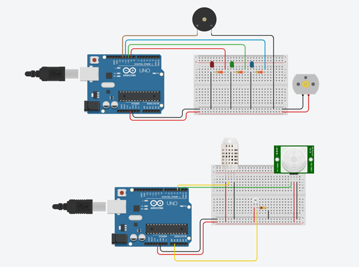
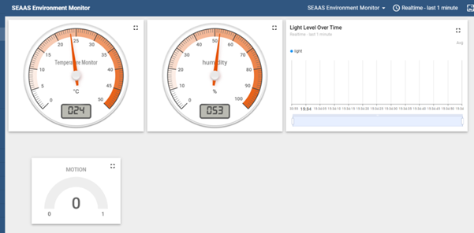
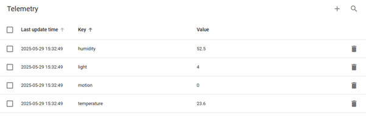
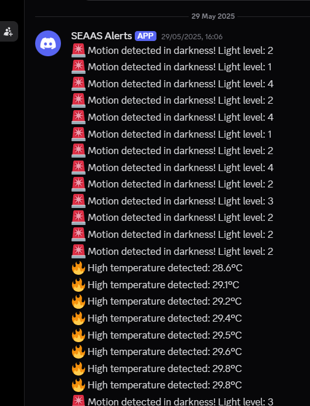

# 🌱 Smart Environmental Alert & Automation System (SEAAS)


The **Smart Environmental Alert & Automation System (SEAAS)** is an IoT project that monitors environmental conditions and automates responses in real time.  
It integrates **Arduino, Raspberry Pi, Thingsboard Cloud, MQTT, and Discord API** to create a smart monitoring and automation ecosystem.

---

## ✨ Features

- 🌡️ **Real-Time Monitoring**  
  Tracks temperature, humidity, motion, and light levels.

- ⚡ **Automated Responses**  
  - Fan turns on when temperature crosses threshold.  
  - RGB LED changes color (Green = Normal, Red = High Temp, Blue = Motion in Dark).  
  - Buzzer triggers on motion detection in darkness.  

- ☁️ **Cloud Dashboard**  
  Live visualization of sensor telemetry via **Thingsboard**.

- 🔔 **Discord Alerts**  
  Instant notifications for critical events (high temperature, motion in darkness).

- 🖥️ **Edge Computing**  
  Two Raspberry Pi nodes handle data and actuator logic for fast responses.

---

## 🏗️ System Architecture

The system is divided into **two nodes** connected via MQTT:

1. **Sensor Node** (Arduino A1 + Raspberry Pi A)  
   - Collects data from **DHT22 (Temp/Humidity)**, **PIR Motion Sensor**, and **Phototransistor Light Sensor**.  
   - Publishes telemetry to MQTT + Thingsboard.  
   - Sends direct alerts to Discord.

2. **Actuator Node** (Arduino A2 + Raspberry Pi B)  
   - Subscribes to sensor data.  
   - Controls **Fan (Relay)**, **RGB LED**, and **Buzzer**.  

📌 **Architecture Diagram**  


---

## 🔌 Hardware Components

- 2x **Arduino UNO**  
- 2x **Raspberry Pi**  
- **DHT22 Temperature & Humidity Sensor**  
- **PIR Motion Sensor**  
- **Phototransistor Light Sensor**  
- **Relay-controlled Fan**  
- **RGB LED**  
- **Piezo Buzzer**

📌 **Circuit Diagram**  


---

## 🖥️ Software & Tools

- Arduino IDE (microcontroller programming)  
- Python (edge logic on Raspberry Pi)  
- Thingsboard Cloud (IoT dashboards)  
- Eclipse Mosquitto (public MQTT broker)  
- Discord API (webhook alerts)

---

## 📸 Screenshots

### 🌡️ Thingsboard Dashboard


### 📊 Telemetry Data


### 🔔 Discord Alerts


---

## ⚙️ Setup & Usage

### 1. Hardware Setup
- Connect **Arduino A1 (sensors)** → Raspberry Pi A.  
- Connect **Arduino A2 (actuators)** → Raspberry Pi B.  

### 2. Run Edge Programs
On Raspberry Pi A and B (data collection):
```bash
python pi_a.py
python pi_b.py